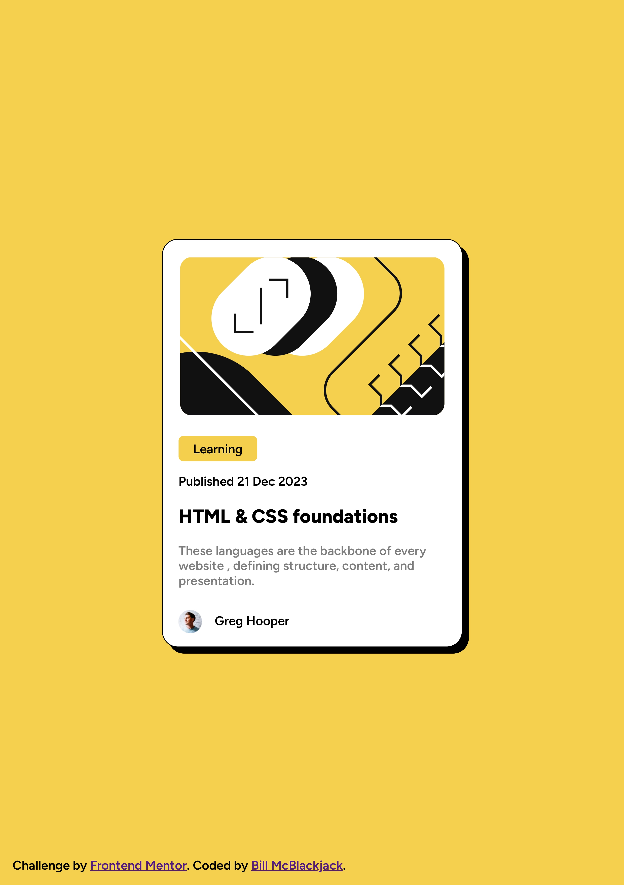

# Frontend Mentor - Blog preview card solution

This is a solution to the [Blog preview card challenge on Frontend Mentor](https://www.frontendmentor.io/challenges/blog-preview-card-ckPaj01IcS). Frontend Mentor challenges help you improve your coding skills by building realistic projects. 

## Table of contents

- [Overview](#overview)
  - [The challenge](#the-challenge)
  - [Screenshot](#screenshot)
  - [Links](#links)
  - [Built with](#built-with)
  - [What I learned](#what-i-learned)
- [Author](#author)

## Overview

### The challenge

Users should be able to:

- See hover and focus states for all interactive elements on the page

### Screenshot



### Links

- Solution URL: [Add solution URL here](https://your-solution-url.com)
- Live Site URL: [Add live site URL here](https://your-live-site-url.com)

### Built with

- Semantic HTML5 markup
- CSS custom properties
- Flexbox
- CSS Grid

### What I learned

```html
      <h1 class="heading-text" onmouseover="changeColor(this)"
      onmouseout="restoreColor(this)">HTML & CSS foundations</h1>
```
```css
.proud-of-this-css {
  cursor: pointer;
}
```
```js
        function changeColor(element) {
          element.style.color = "hsl(47, 88%, 63%)";
        }

        function restoreColor(element) {
          element.style.color = "";
        }
```

## Author

- Frontend Mentor - [@BillMcBlackjack](https://www.frontendmentor.io/profile/BillMcBlackjack)